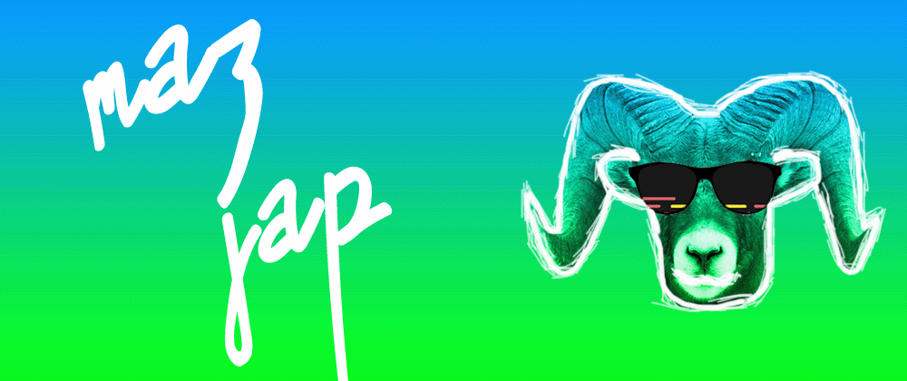

[![Website][website-img]][website-url]
[![LinkedIn][linkedin-img]][linkedin-url]
[![Email][email-img]][email-url]

#### Languages:

[![Swift][swift-img]][no-link]
[![Objective-C][objc-img]][no-link]
[![Python][python-img]][no-link]
[![Java][java-img]][no-link]
[![C++][cpp-img]][no-link]

#### Technologies:

[![Xcode][xcode-img]][no-link]
[![VSCode][vscode-img]][no-link]
[![Git][git-img]][no-link]
[![Github][github-img]][no-link]
[![Adobe InDesign][indesign-img]][no-link]

[swift-img]: https://img.shields.io/badge/-Swift-black?style=flat&logo=swift
[objc-img]: https://img.shields.io/badge/objc-Objective%20C-black?style=flat
[python-img]: https://img.shields.io/badge/-Python-black?style=flat&logo=python
[java-img]: https://img.shields.io/badge/-Java-black?style=flat&logo=java
[cpp-img]: https://img.shields.io/badge/-C++-black?style=flat&logo=c%2B%2B

[xcode-img]: https://img.shields.io/badge/-Xcode-black?style=flat&logo=xcode
[git-img]: https://img.shields.io/badge/-Git-black?style=flat&logo=git
[github-img]: https://img.shields.io/badge/-Github-black?style=flat&logo=github
[vscode-img]: https://img.shields.io/badge/-VSCode-black?style=flat&logo=visual%20studio%20code
[indesign-img]: https://img.shields.io/badge/-InDesign-black?style=flat&logo=adobe%20indesign

[website-img]: https://img.shields.io/badge/-Jordan%20Christensen.com-purple?style=for-the-badge&logo=google-chrome&logoColor=white
[linkedin-img]: https://img.shields.io/badge/-LinkedIn-blue?style=for-the-badge&logo=linkedin&logoColor=white
[email-img]: https://img.shields.io/badge/-Gmail-red?style=for-the-badge&logo=gmail&logoColor=white

[website-url]: https://jordan-christensen.com/
[linkedin-url]: https://www.linkedin.com/in/jordan-a-christensen/
[email-url]: mailto:jordan.c4922@gmail.com

[no-link]: #
